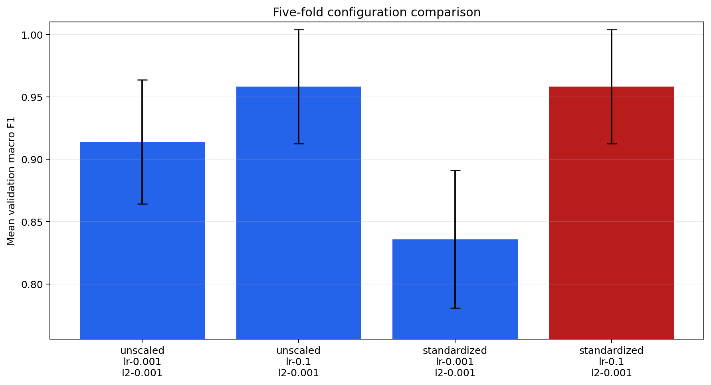
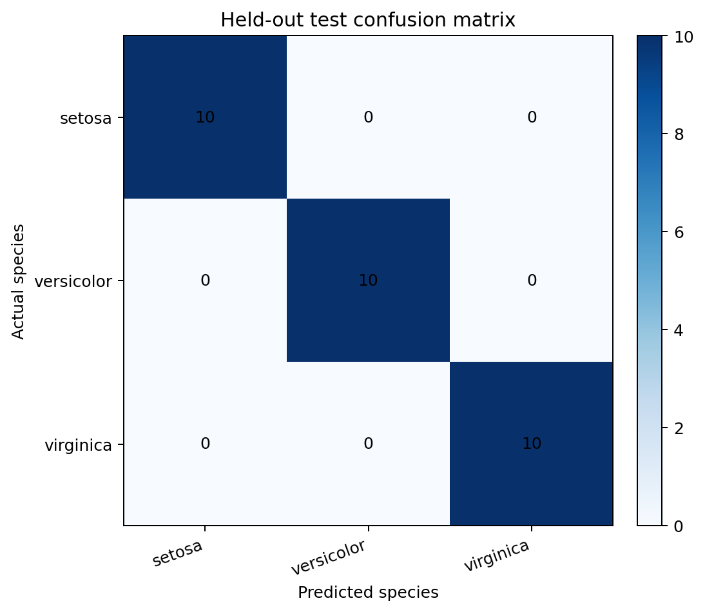
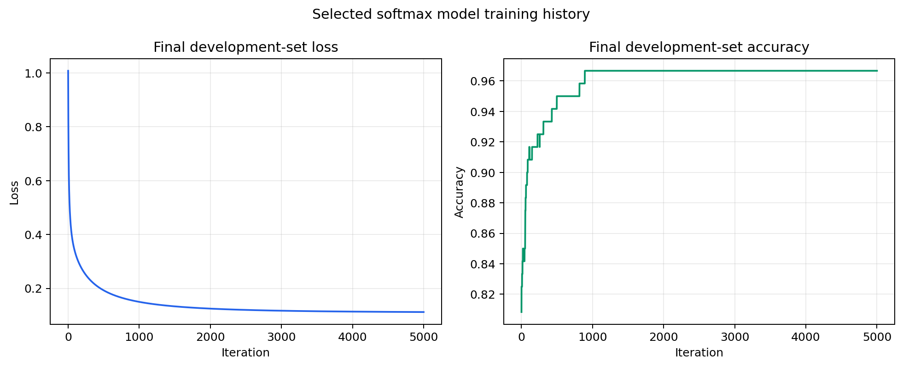
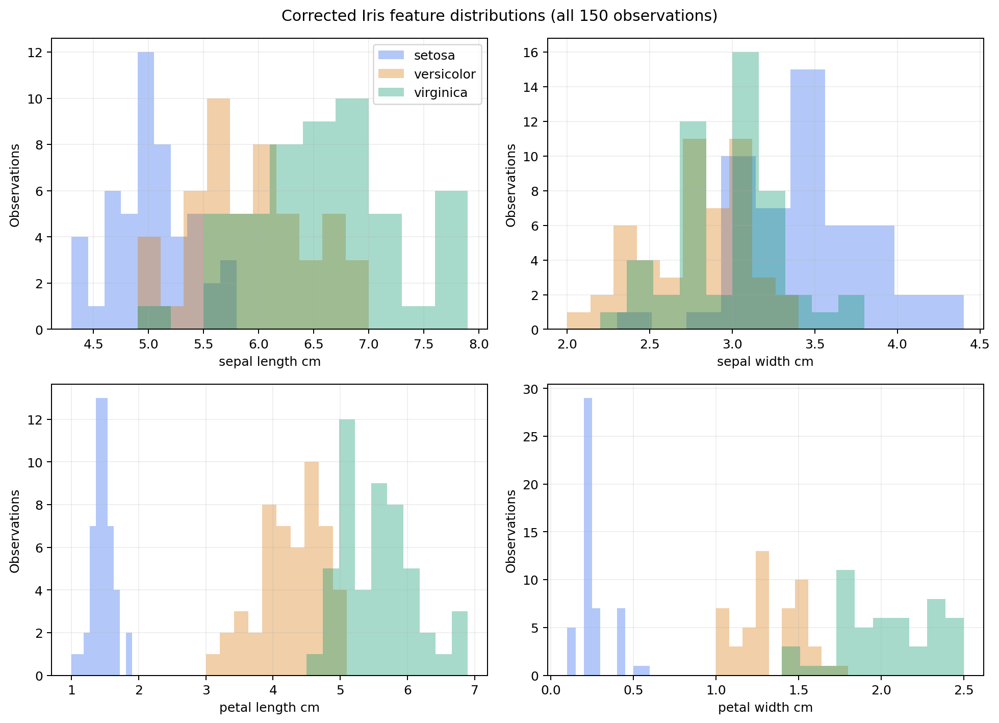

# Iris Multiclass Softmax Classifier from Scratch

This project implements multiclass softmax regression for the corrected UCI Iris dataset using NumPy.

The classifier is built for educational transparency. The softmax function, cross-entropy loss, analytical gradient, L2 regularisation, feature standardisation, grouped data splitting, cross-validation, model selection, confusion matrix, and evaluation metrics are implemented without a machine-learning framework.

The workflow is designed to avoid two common evaluation errors:

- fitting preprocessing statistics using test data;
- selecting a model configuration using test-set performance.

The bundled reference run selects the model using five-fold cross-validation within a 120-observation development set. The remaining 30 observations are held back and evaluated once after selection.

## Main Aim

The project demonstrates how a three-class linear classifier can be trained from first principles while preserving a defensible evaluation boundary.

The model predicts one of three species:

| Class | Species |
|---:|---|
| `0` | Iris setosa |
| `1` | Iris versicolor |
| `2` | Iris virginica |

The analysis compares four configurations formed from two learning rates and two preprocessing choices. The best configuration is selected using mean validation macro F1, with validation accuracy and validation loss used as tie-breakers.

## What the Code Does

The main program:

1. loads the corrected Iris data from the repository;
2. validates its dimensions, class counts, and numerical values;
3. assigns identical feature-and-class records to shared groups;
4. creates a deterministic, stratified, group-preserving development/test split;
5. performs five-fold grouped cross-validation on the development set;
6. fits standardisation statistics within each training fold when required;
7. trains every candidate using full-batch gradient descent;
8. applies validation-loss early stopping during cross-validation;
9. selects the best candidate without examining the test set;
10. refits the selected configuration on the complete development set;
11. evaluates the final model once on the held-out test set;
12. saves metrics, fold results, training history, model parameters, and plots.

## Dataset

The repository includes the corrected `bezdekIris.data` file from the [UCI Machine Learning Repository](https://archive.ics.uci.edu/dataset/53/iris).

The dataset contains 150 observations and four measurements recorded in centimetres:

| Feature | Description |
|---|---|
| `sepal_length_cm` | Sepal length |
| `sepal_width_cm` | Sepal width |
| `petal_length_cm` | Petal length |
| `petal_width_cm` | Petal width |

Each species contains 50 observations. The data contain no missing values.

The raw file is retained unchanged in:

```text
data/raw/bezdekIris.data
```

Its SHA-256 checksum is recorded in `data/raw/SHA256SUMS`. Full source, DOI, licence, and correction details are provided in [`DATASET_ATTRIBUTION.md`](DATASET_ATTRIBUTION.md).

### Optional prepared CSV

The raw data can be converted to a named, row-oriented CSV using:

```bash
python scripts/prepare_data.py
```

This creates:

```text
data/processed/iris_corrected.csv
```

The script refuses to overwrite an existing output unless `--force` is supplied. The bundled raw file is never modified.

## Data Integrity and Leakage Controls

### Grouping identical records

The corrected dataset contains 150 rows but 149 unique feature-and-class groups because one record is repeated.

Identical records receive the same group identifier. The grouped splitter keeps every group within one subset, preventing an identical flower record from appearing on opposite sides of the development/test boundary or in both the training and validation portions of a cross-validation fold.

### Development and test separation

The default split is:

| Subset | Observations | Observations per species | Purpose |
|---|---:|---:|---|
| Development | 120 | 40 | Cross-validation, model selection, and final fitting |
| Test | 30 | 10 | One final evaluation after selection |

The test observations are not used to select the learning rate, decide whether to standardise, determine the final training duration, or fit scaling statistics.

### Training-only standardisation

For a feature $x_j$, standardisation uses

```math
x'_j=\frac{x_j-\mu_j}{\sigma_j}.
```

During cross-validation, $\mu_j$ and $\sigma_j$ are calculated from the training portion of the current fold and then applied to its validation portion.

After configuration selection, a new scaler is fitted using all 120 development observations and then applied to the test set. Test-set values therefore do not influence preprocessing.

## Softmax Model

For observation $i$, the model calculates one score for each class:

```math
\mathbf{z}_i=\tilde{\mathbf{x}}_i^T\mathbf{W},
```

where $\tilde{\mathbf{x}}_i$ contains a leading bias value and $\mathbf{W}$ is the weight matrix.

The probability assigned to class $k$ is

```math
p_{ik}
=
\frac{\exp(z_{ik}-m_i)}
{\sum_c\exp(z_{ic}-m_i)},
\qquad
m_i=\max_c z_{ic}.
```

Subtracting the maximum score before exponentiation makes the softmax calculation numerically stable.

The predicted class is

```math
\hat{y}_i=\mathrm{arg\,max}_k p_{ik}.
```

## Loss and Regularisation

Training minimises mean multiclass cross-entropy with an L2 penalty:

```math
J(\mathbf{W})
=
-\frac{1}{n}\sum_{i=1}^{n}\log p_{i,y_i}
+
\frac{\lambda}{2}\left\|\mathbf{W}_{\mathrm{nonbias}}\right\|_F^2.
```

The bias row is excluded from regularisation.

With a one-hot target matrix $\mathbf{Y}$ and probability matrix $\mathbf{P}$, the gradient is

```math
\nabla J(\mathbf{W})
=
\frac{1}{n}\tilde{\mathbf{X}}^T(\mathbf{P}-\mathbf{Y})
+
\lambda\mathbf{W}_{\mathrm{nonbias}}.
```

The implementation uses the same value of $\lambda$ in the loss and gradient. A finite-difference unit test checks the analytical gradient, including the L2 term.

## Gradient Descent and Early Stopping

Weights are initialised to zero and updated using full-batch gradient descent:

```math
\mathbf{W}^{(t+1)}
=
\mathbf{W}^{(t)}
-
\eta\nabla J\!\left(\mathbf{W}^{(t)}\right),
```

where $\eta$ is the learning rate.

During cross-validation, the best weights are retained according to validation loss. Training stops when the loss fails to improve by at least `1e-7` for 300 consecutive iterations, or when the 5,000-iteration limit is reached.

The final number of iterations is the median best iteration from the selected candidate's five validation folds. The final model is then fitted once to the full development set without using the test set for early stopping.

## Configuration Comparison

The default experiment compares the same four core configurations:

| Standardised | Learning rate | L2 strength |
|---|---:|---:|
| No | `0.001` | `0.001` |
| No | `0.1` | `0.001` |
| Yes | `0.001` | `0.001` |
| Yes | `0.1` | `0.001` |

Each candidate is evaluated using five grouped folds within the development set. Every fold contains 96 training observations and 24 validation observations.

Candidates are ranked by:

1. highest mean validation macro F1;
2. highest mean validation accuracy;
3. lowest mean validation loss.

The held-out test set is not part of this ranking.

## Default Configuration

| Setting | Default | Description |
|---|---:|---|
| `seed` | `42` | Reproducible grouped splitting |
| `test_fraction` | `0.20` | Final test proportion |
| `folds` | `5` | Development-set cross-validation folds |
| `max_iterations` | `5000` | Maximum iterations per fit |
| `patience` | `300` | Early-stopping patience |
| `min_delta` | `1e-7` | Required validation-loss improvement |
| `l2_strength` | `0.001` | Non-bias L2 regularisation strength |

The command-line interface exposes all settings except `min_delta`, which is defined by `ExperimentConfig`.

## Reference Results

The stored results were produced using the default configuration and the bundled corrected dataset.

### Cross-validation results

| Configuration | Mean macro F1 | Standard deviation | Mean accuracy | Mean validation loss |
|---|---:|---:|---:|---:|
| Unscaled, learning rate `0.001` | `0.9138` | `0.0497` | `0.9167` | `0.4527` |
| Unscaled, learning rate `0.1` | `0.9582` | `0.0458` | `0.9583` | `0.1370` |
| Standardised, learning rate `0.001` | `0.8358` | `0.0551` | `0.8417` | `0.4092` |
| **Standardised, learning rate `0.1`** | **`0.9582`** | **`0.0458`** | **`0.9583`** | **`0.1264`** |

The two learning-rate `0.1` candidates have equal mean macro F1 and mean accuracy. Standardisation is selected because it produces the lower mean validation loss.



### Final model

The selected configuration is:

```text
Standardisation: Yes
Learning rate:   0.1
L2 strength:     0.001
Iterations:      5000
```

| Subset | Accuracy | Macro precision | Macro recall | Macro F1 | Balanced accuracy |
|---|---:|---:|---:|---:|---:|
| Development | `0.9667` | `0.9674` | `0.9667` | `0.9666` | `0.9667` |
| Held-out test | `1.0000` | `1.0000` | `1.0000` | `1.0000` | `1.0000` |

The test confusion matrix uses actual classes as rows and predicted classes as columns:

| Actual class | Predicted setosa | Predicted versicolor | Predicted virginica |
|---|---:|---:|---:|
| Setosa | 10 | 0 | 0 |
| Versicolor | 0 | 10 | 0 |
| Virginica | 0 | 0 | 10 |



The 100% test result is the outcome of one deterministic 30-observation holdout. It is a valid test estimate for this fixed workflow because the test set was not used during configuration selection, but the small sample size means it should not be interpreted as a guarantee of perfect performance on new data.

Complete reference values are stored in:

- [`results/default_metrics.json`](results/default_metrics.json);
- [`results/cross_validation_results.csv`](results/cross_validation_results.csv).

## Diagnostic Plots

### Training history

The final refit records development-set loss and accuracy at every iteration.



### Feature distributions

The feature histograms show why petal length and petal width are especially useful for separating the three species. Setosa is clearly separated, while versicolor and virginica overlap more strongly.



## Repository Contents

```text
.
├── .github/
│   └── workflows/
│       └── tests.yml
├── assets/
│   ├── cross_validation_comparison.png
│   ├── feature_distributions.png
│   ├── test_confusion_matrix.png
│   └── training_diagnostics.png
├── data/
│   └── raw/
│       ├── SHA256SUMS
│       └── bezdekIris.data
├── results/
│   ├── cross_validation_results.csv
│   └── default_metrics.json
├── scripts/
│   └── prepare_data.py
├── tests/
│   ├── test_data_pipeline.py
│   └── test_model.py
├── .gitignore
├── DATASET_ATTRIBUTION.md
├── README.md
├── iris_softmax_classifier.py
└── requirements.txt
```

Generated runtime outputs are written to `outputs/` and are ignored by Git.

## Requirements

The project is tested with Python 3.10 and Python 3.12.

Required packages:

```text
numpy
matplotlib
```

NumPy is required for the model and numerical workflow. Matplotlib is only imported when plots are requested.

## Installation

Clone or download the repository, then enter its root directory:

```bash
cd Iris-Multiclass-Softmax-Classifier-from-Scratch
```

Create and activate a virtual environment:

```bash
python -m venv .venv
source .venv/bin/activate
```

On Windows PowerShell, activate it using:

```powershell
.venv\Scripts\Activate.ps1
```

Install the dependencies:

```bash
python -m pip install --upgrade pip
python -m pip install -r requirements.txt
```

## Running the Experiment

Run the complete default workflow using:

```bash
python iris_softmax_classifier.py
```

The program prints the selected candidate and held-out test metrics, then writes the full output bundle to `outputs/`.

To choose a different output directory:

```bash
python iris_softmax_classifier.py --output-dir outputs/custom_run
```

To run the numerical experiment without creating plots:

```bash
python iris_softmax_classifier.py --no-plots
```

### Command-line options

| Option | Default | Description |
|---|---:|---|
| `--data` | `data/raw/bezdekIris.data` | Input data file |
| `--output-dir` | `outputs/` | Generated output directory |
| `--seed` | `42` | Split seed |
| `--test-fraction` | `0.20` | Held-out test fraction |
| `--folds` | `5` | Number of cross-validation folds |
| `--max-iterations` | `5000` | Maximum iterations per fit |
| `--patience` | `300` | Early-stopping patience |
| `--l2-strength` | `0.001` | L2 regularisation strength |
| `--no-plots` | Disabled | Skip plot generation |

For example:

```bash
python iris_softmax_classifier.py \
  --seed 7 \
  --folds 3 \
  --max-iterations 3000 \
  --l2-strength 0.0005 \
  --output-dir outputs/experiment_seed_7
```

## Generated Outputs

A complete run creates:

| File | Description |
|---|---|
| `metrics.json` | Configuration, split sizes, cross-validation summary, and final metrics |
| `cross_validation_results.csv` | Per-candidate results for every validation fold |
| `training_history.csv` | Final development-set loss and accuracy by iteration |
| `model.npz` | Weights, scaler values, class names, feature names, and selected settings |
| `cross_validation_comparison.png` | Mean validation macro F1 comparison |
| `training_diagnostics.png` | Final training loss and accuracy |
| `test_confusion_matrix.png` | Held-out test confusion matrix |
| `feature_distributions.png` | Dataset feature histograms by species |

When `--no-plots` is supplied, the four PNG files are omitted.

## Running the Tests

Run the complete test suite using:

```bash
python -m unittest discover -s tests -v
```

The tests cover:

- corrected dataset values and structure;
- class counts and duplicate-record grouping;
- deterministic balanced group-preserving splits;
- five-fold coverage of the development data;
- training-only standardisation;
- non-destructive prepared-CSV generation;
- numerical stability of softmax;
- analytical-gradient agreement with finite differences;
- learning on a separable three-class dataset;
- confusion matrices and multiclass metrics.

The GitHub Actions workflow runs the tests and a command-line smoke test on Python 3.10 and Python 3.12 for every push and pull request.

## Reproducibility

The default split is deterministic for seed `42`. The training process does not use random weight initialisation, so identical inputs, dependencies, and arguments reproduce the stored configuration choice and metrics.

To verify the bundled raw data on a system with `sha256sum`:

```bash
cd data/raw
sha256sum -c SHA256SUMS
```

The stored reference artifacts were generated from the same code and raw-data checksum included in this repository.

## Limitations

This project is intended to demonstrate multiclass optimisation and careful evaluation rather than provide a production prediction service.

Important limitations include:

- Iris is a small, clean, balanced benchmark dataset;
- the final test estimate contains only 30 observations;
- the reference result comes from one deterministic holdout rather than repeated outer resampling;
- only four candidate configurations are compared;
- the classifier learns linear decision boundaries;
- early stopping is available during cross-validation, but several reference folds reach the 5,000-iteration limit;
- the saved `.npz` artifact stores model parameters but is not exposed through a separate prediction application or service.

The 100% test accuracy should therefore be read alongside the cross-validation distribution and the evaluation design, not as evidence that the classifier will be perfect on all future Iris measurements.

## Possible Improvements

Future extensions could include:

- repeated nested cross-validation for a less split-dependent performance estimate;
- confidence intervals for test metrics;
- probability calibration and calibration plots;
- learning-rate schedules or accelerated optimisers;
- additional regularisation values selected within cross-validation;
- a dedicated inference command for loading `model.npz`;
- comparisons with scikit-learn reference implementations;
- decision-region plots for selected feature pairs.

## Dataset Attribution

The Iris dataset was created by R. A. Fisher and is distributed by the UCI Machine Learning Repository under the Creative Commons Attribution 4.0 International licence.

Recommended citation:

> Fisher, R. (1936). *Iris* [Dataset]. UCI Machine Learning Repository. https://doi.org/10.24432/C56C76

See [`DATASET_ATTRIBUTION.md`](DATASET_ATTRIBUTION.md) for the dataset URL, corrected-file details, checksum information, and licence link.
